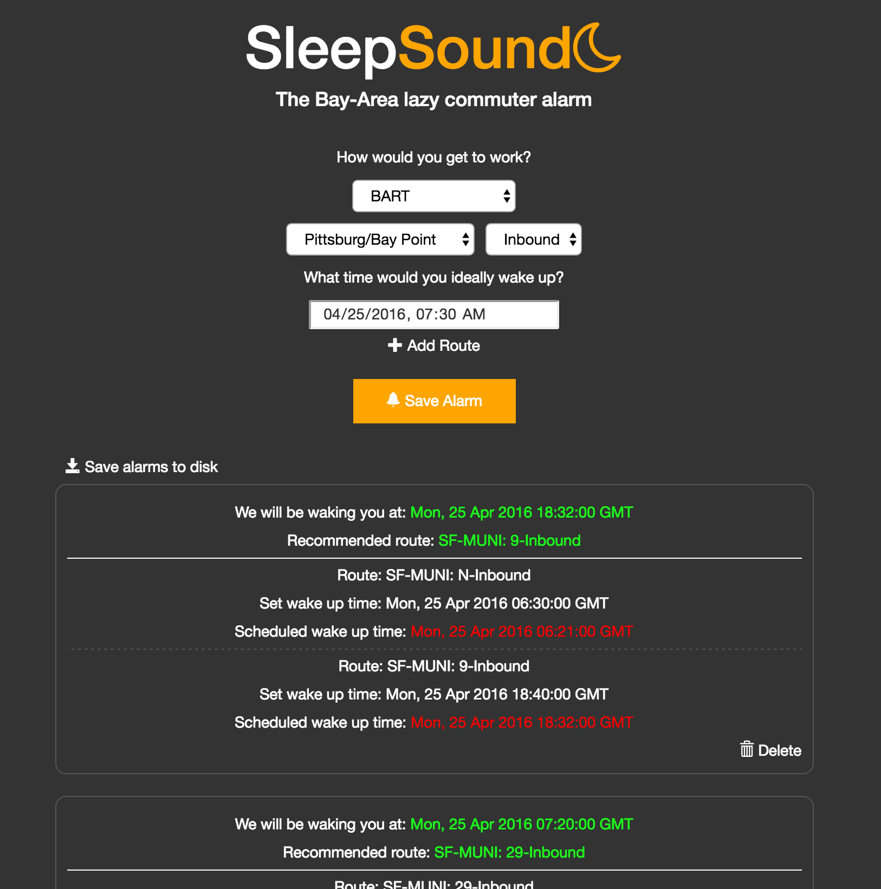

# SleepSound

A Bay-Area smart alarm which takes into account various public transport routes and real-time traffic info to wake you up as late as possible.



## Contents

* [Getting Started](#getting-started)
    * [Installation](#installation)
    * [Development](#development)
* [API Endpoints](#api-endpoints)
* [Contributing](#contributing)
* [License](#license)

## Getting Started

### Installation
1. Install [Node and NPM](https://nodejs.org/en/)
1. Install Bower

    ```
    $ npm install -g bower
    ```

1. Install dependencies.

    ```
    $ npm install
    $ bower install
    ```

1. Start server.

    ```
    $ node server/app.js
    ```

### Development
1. Install [Grunt](http://gruntjs.com/) CLI

    ```
    $ npm install -g grunt-cli
    ```

1. Install nodemon.

    ```
    $ npm install -g nodemon
    ```

1. Start Grunt [Browserify](http://browserify.org/) listener and nodemon server refresh.

    ```
    $ grunt
    ```

## API Endpoints

Please see the [endpoints documentation](/ENDPOINTS.md) for information regarding API endpoints.

## Contributing

Please see the [issues page](https://github.com/travisbaratcart/sleepsound/issues) for outstanding issues and the [contribution guidelines](/CONTRIBUTING.md) for more information about contributing to SleepSound.

## License

MIT
